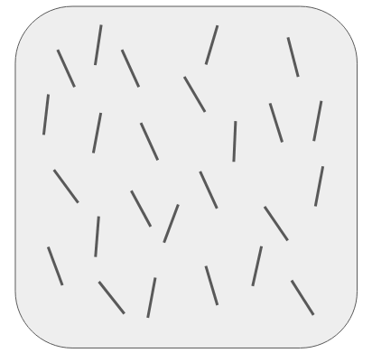

# Lab 3: Sequential Sampling Models

Goals of this lab

- [ ] Learn how to implement a sequential sampling model
- [ ] Start to explore the idea of model selection

## Part 1: Build a sequential sampling model

Chapter 2 from Farrell & Lewandowsky describes the basic ideas behind sequential sampling models. To briefly recap, they use a stimulus like this to motivate the model:

Are there more lines pointing to the left or to the right? Sequential sampling models propose that this decision is made through the gradual accumulation of evidence until enough evidence has been accumulated that a decision is made. This family of models is able to make predictions about both response time and accuracy.

Farrell & Lewandowsky describe how to construct one variant of a sequential sampling model, the random walk model. The basic model works like this:

1. On each trial, start the internal evidence signal at 0.
2. Sample a value from a normal distribution with mean `drift` and standard deviation `sdrw`.
3. Add this value to the internal evidence signal.
4. Repeat steps 2 & 3 until the evidence signal is greater than `criterion` or less than `-criterion`.
5. Report the number of samples it took to reach the threshold. 

If the model reaches `criterion` then it has responded correctly. If it reaches `-criterion` it has responded incorrectly. The number of samples it takes to reach the threshold is the number of milliseconds it took to respond. (So the model assumes that one sample is taken every millisecond.)

Steps 1-5 can be repeated many times to generate a distribution of responses. 

For part 1 of the lab, **implement the random walk model described above** in the file `1-random-walk-model.R`. You can borrow your implementation from Farrell & Lewandowsky, or you can implement it in a way that is most intuitive to you. If you do borrow from Farrell & Lewandowsky, I'd suggest trying to implement on your own before referencing their implementation, so you can practice converting a model description into code.

## Part 2: Build a variation on the sequential sampling model

On page 38 of Farrell & Lewandowsky, a whole family of sequential sampling models is described. One member of the family is the **accumulator model**. Here's one way this model could work (there are many ways to implement an accumulator model):

1. For each response option, initialize an evidence accumulator.
2. On each step, sample a value from an exponential distribution (use `rexp()`) with a unique `rate` parameter for each response option. 
3. Add the sampled value to the evidence accumulator for that option.
4. Repeat steps 2 & 3 until one of the accumulators passes the evidence threshold `criterion`. 
5. The model selects the option that passed the threshold. If more than one accumulator passes the threshold in the same step, then the one with the greater accumulated evidence is the response. The response time is the number of steps it took to reach the criterion.

Implement this model in the file `2-accumulator-model.R`. There's probably enough overlap with the random walk model that it makes sense to copy that code and modify it, but that is up to you. For our implementation, we will implement a version of the model that only works with 2 response options, but you could generalize this to *n* options if you wanted.

## Part 3: Simple model selection

We now have two competing sequential sampling models. While neither of these models would do a particularly good job of fitting real data (for reasons described in the Farrell & Lewandowsky reading), we can start to appreciate how model selection could work. Open the file `3-model-selection.R` and follow the instructions therein.

